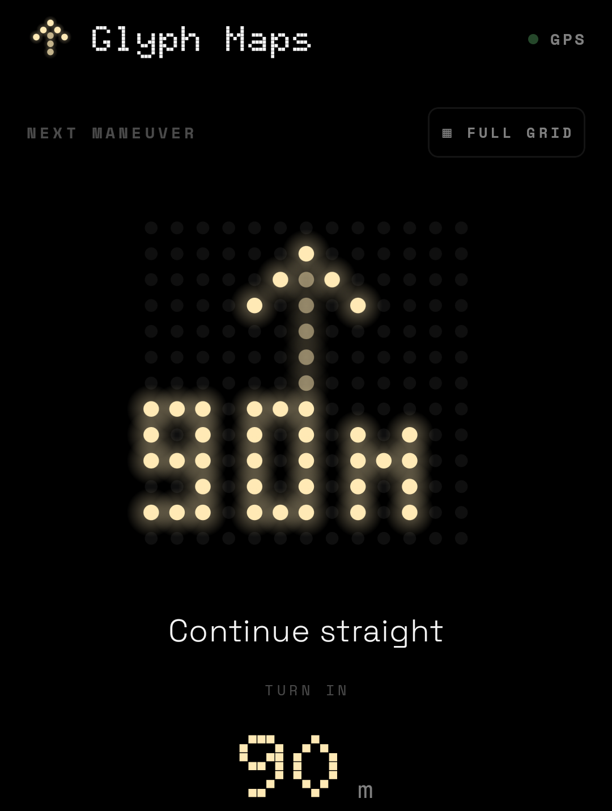
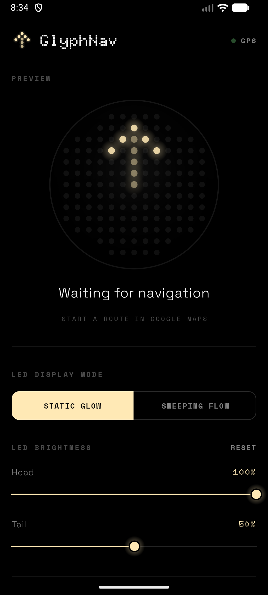

<div align="center">

# GlyphMaps

**Turn-by-turn navigation on the back of your Nothing Phone (4a) Pro.**

GlyphMaps mirrors Google Maps' next turn — the maneuver arrow and the distance
to it — onto the rear Glyph Matrix while you navigate. Glance at the back of
your phone instead of the screen.

[](https://github.com/capad-xyz/GlyphMaps/releases/latest)
-blue)


_Pro-000000)




### [⬇️ Download the latest APK](https://github.com/capad-xyz/GlyphMaps/releases/latest)

</div>

---

## What it does

- 🧭 Shows the **next maneuver** — turn left/right, sharp turns, keep left/right,
  forks, roundabouts, U-turns and "arrived" — as a clean dot-matrix arrow.
- 📏 Scrolls the **distance to the turn** ("300m", "1.5k") beneath the arrow.
- 🔌 Reads directions straight from Google Maps' **Live Updates** notification —
  no Google API key, no account, no extra setup.
- 🤝 **Only claims the Matrix while you're actually navigating.** Start a route
  and it takes over; end the route and it hands the Matrix straight back to
  whatever Glyph toy you normally run.
- 🔒 **100% on-device.** No network code, no analytics, no account — it reads
  one notification and draws dots. Nothing leaves your phone.

## Screenshots

<div align="center">

&nbsp;&nbsp;

</div>

<p align="center"><sub>Left: the app's main screen (live preview · display mode · brightness). Right: the next-turn readout. <br/>The money shot — the lit Matrix on the back of the phone during a route — needs an external camera (see <a href="#recording-a-demo">Recording a demo</a>).</sub></p>

## Requirements

- **Nothing Phone (4a) Pro** — the model with the circular Glyph Matrix (137 LEDs).
- **Nothing OS / Android 14+** with Google Maps **Live Updates** (default on
  recent Maps versions).
- **Google Maps** running an active route — GlyphMaps *mirrors* Maps; it is not
  a standalone navigation app and does no routing of its own.

## Getting started

1. **Install** — download **[GlyphMaps&#8209;1.0.0.apk](https://github.com/capad-xyz/GlyphMaps/releases/latest)**
   onto your phone and tap to install (allow *Install from unknown sources* if
   prompted), or `adb install GlyphMaps-1.0.0.apk`. You can also build from
   source (below).
2. **Grant Notification Access** — on first launch the app links you to the
   system setting. This is *required*: it's how GlyphMaps reads Maps' live
   directions. (It's filtered to the Google Maps package + the `navigation`
   category — everything else is ignored.)
3. **Navigate** — open Google Maps, start any route, flip your phone over. The
   Matrix lights up with your next turn. The app doesn't even need to stay open.

> [!NOTE]
> If you also run a custom **Glyph Toy**, grant Notification Access to only one
> Glyph-Matrix app at a time — two listeners will fight over the Matrix during
> navigation.

## Customisation

- **LED brightness** — independent **head** (the bright arrowhead) and **tail**
  (the dim trail) sliders, persisted across sessions.
- **Display mode** — *Static Glow* (steady) or *Sweeping Flow* (a comet animates
  along the arrow toward the turn). The sweep is generated from the static
  pattern, so the two always match.
- **Speed-aware preview** — a far-off turn shows a "continue, then turn" arrow and
  flips to the direct icon as you approach, matching Google's own preview window
  scaled to your current speed.

## Privacy

- The app reads **only Google Maps' navigation notification** (filtered by
  package + the `navigation` category). It ignores everything else — even other
  Maps notifications.
- **Nothing leaves your phone.** There is no networking code, no analytics, no
  account, no ads.
- The only thing stored is your display preferences (brightness, mode) in
  private app storage.
- Notification access is a powerful permission — the source is right here, so you
  can verify exactly what it does in
  [`MapsNotificationListener.kt`](app/src/main/kotlin/com/glyphnavtoy/service/MapsNotificationListener.kt).

Full policy: [`PRIVACY_POLICY.md`](PRIVACY_POLICY.md).

## How it works

The 4a Pro restricts *Glyph Toys* to always-on-display only, with a ~1-minute
update cadence — far too slow for live navigation. GlyphMaps sidesteps that:
it's a normal app that drives the Matrix directly with `setAppMatrixFrame`, only
while a route is active.

```
Google Maps  (Live Updates notification, ~every 2-5s)
    │
    ▼
MapsNotificationListener   reads title + distance, maps Google's maneuver
    │                      vocabulary → our 12-maneuver set, derives speed
    ▼
GlyphRenderService         foreground service, alive ONLY during nav;
    │                      releases the Matrix on route end
    ▼
MatrixComposer → GlyphRenderer → setAppMatrixFrame()
    │
    ▼
Glyph Matrix  (137 LEDs, circular 13×13)
```

### Project layout

```
app/src/main/kotlin/com/glyphnavtoy/
  MainActivity.kt              Compose UI (clean user build · full dev build)
  glyph/
    Maneuver.kt                12-maneuver set + Google-vocabulary mapping
    ArrowBitmaps.kt            dot-matrix arrow patterns (head/tail chars)
    ArrowSweep.kt              procedural sweep animation, derived from static
    MatrixFrame.kt             13×13 grid + circular LED mask
    MatrixComposer.kt          NavState → frame (arrow + distance marquee)
    GlyphRenderer.kt           owns GlyphMatrixManager, pushes frames
    GlyphSettings.kt           head/tail brightness + display mode, persisted
    DigitFont.kt               3×5 pixel font for the distance marquee
  nav/
    NavState.kt · NavStateRepo.kt · Speedometer.kt · PresetRoute.kt
  service/
    GlyphRenderService.kt      foreground render loop (nav-only lifecycle)
    MapsNotificationListener.kt  reads Maps, parses, forwards
  capture/CaptureWriter.kt     dev-only on-device capture log
```

## Build from source

Two flavors install side by side:

| Flavor | App ID | What's in it |
|---|---|---|
| **user** | `com.glyphnavtoy` | The clean product — live preview, display mode, brightness. |
| **dev** | `com.glyphnavtoy.dev` | Everything + manual maneuver override, route simulator, capture log. |

```sh
# Dev build → install + relaunch on a connected device
push.cmd

# Signed USER release App Bundle (.aab) for Google Play
build-release.cmd
```

The dev APK lands in `app/build/outputs/apk/dev/debug/`; the release bundle in
`app/build/outputs/bundle/userRelease/app-user-release.aab`. On a standard
machine, plain `./gradlew :app:assembleUserDebug` works too.

> [!TIP]
> Release signing reads from a gitignored `keystore.properties` at the repo root
> (it falls back to the debug key when absent, so clones still build). See
> [`PUBLISHING.md`](PUBLISHING.md) to set up your own upload key.

## Publishing

[`PUBLISHING.md`](PUBLISHING.md) is the full Google Play checklist — signing,
Data Safety answers, the Notification Access + special-use foreground-service
declarations, store-listing copy, and the asset list.

## Roadmap

- [x] Procedural sweep animation that always matches the static arrows
- [x] Head/tail LED brightness
- [x] Clean user build vs. full dev build (manual override + capture log)
- [x] Release-ready: signed + minified AAB, privacy policy, Play declarations
- [ ] Play Store listing (closed testing → production) — see PUBLISHING.md
- [ ] Auto-dim (ambient light / time of day)
- [ ] ETA / speed display modes

## Tech stack

Kotlin · Jetpack Compose · Coroutines · Android `NotificationListenerService` +
foreground service · the [Nothing Glyph Matrix SDK][sdk].

## Recording a demo

The good shot is the **back of the phone** during a route — that needs an
external camera. For the in-app UI:

```sh
adb shell screenrecord /sdcard/demo.mp4   # Ctrl-C to stop
adb pull /sdcard/demo.mp4
```

## Credits

Built for the Nothing community on top of the
[Glyph Matrix Developer Kit][sdk].

## License

**[GNU Affero General Public License v3.0](LICENSE)** (AGPL-3.0).

Use, modify, and redistribute freely — but any modified or derived version you
ship to anyone (including as a hosted service) must publish its full source code
under the same license, with credit preserved. You cannot fold this code into a
closed-source product, paid or otherwise.

### Commercial / proprietary licensing

If AGPL doesn't work for you — e.g. you want to integrate GlyphMaps into a
closed-source product, ship it as a built-in feature of a device or OS, or
embed it without the share-alike obligation — a separate commercial license is
available. Inquiries from **Nothing Technology Ltd.** about integrating
GlyphMaps as a built-in Glyph Matrix feature are explicitly welcome.

Contact: **capad.xyz@gmail.com**

### "GlyphMaps" — name & marks

The name **"GlyphMaps"** and the dot-matrix chevron mark are used to identify
this project and its authors. The AGPL covers the *code*; please don't ship a
fork using the same name or mark in a way that implies it's an official build
or affiliated with the original. Rename your fork.

### Contributions

By submitting a pull request, you agree that your contribution may be
relicensed by the project owner for the purpose of granting a separate
proprietary/commercial license alongside the AGPL.

---

<sub>GlyphMaps is an independent app and is not affiliated with, endorsed by, or
sponsored by Google or Nothing Technology. "Google Maps" and "Nothing" are
trademarks of their respective owners.</sub>

[sdk]: https://github.com/Nothing-Developer-Programme/GlyphMatrix-Developer-Kit
